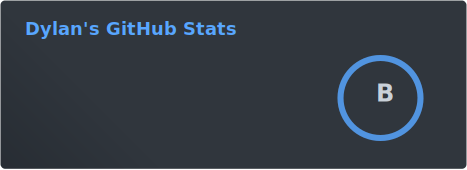
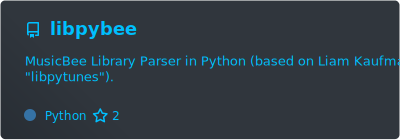
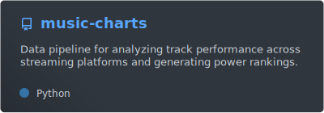
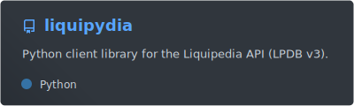
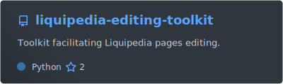

# Hi there 👋

I'm Dylan **"Dyl-M"** Monfret, Data Engineer, graduated in data science / applied mathematics.

## 🤓 About Me

- 👨‍💻 Currently working for ASTEK Raised as Big Data Engineer.
- 🚑 Looking for help / advices on [`libpybee`](https://github.com/Dyl-M/libpybee) & [`liquipydia`](https://github.com/Dyl-M/liquipydia).
- 🤩 Passionate about **IT**, **music** and **sport / e-sport**.

## 🏃‍♂️ Active projects

## 💤 Dormant / stand-by projects

#### 🎥 Automatic YouTube playlists (legacy, exist for long music video only).

- **Repository**: [`auto_youtube_playlist`](https://github.com/Dyl-M/auto_youtube_playlist)
- Processes will be merged into [`youtube_release_tracker`](https://github.com/Dyl-M/youtube_release_tracker).

#### 🎮 Rocket League Championship Series datasets / Machine Learning with Rocket League.

- **Repository**: [`rlcs_data`](https://github.com/Dyl-M/rlcs_data).
- [Kaggle dataset](https://www.kaggle.com/datasets/dylanmonfret/rlcs-202122).